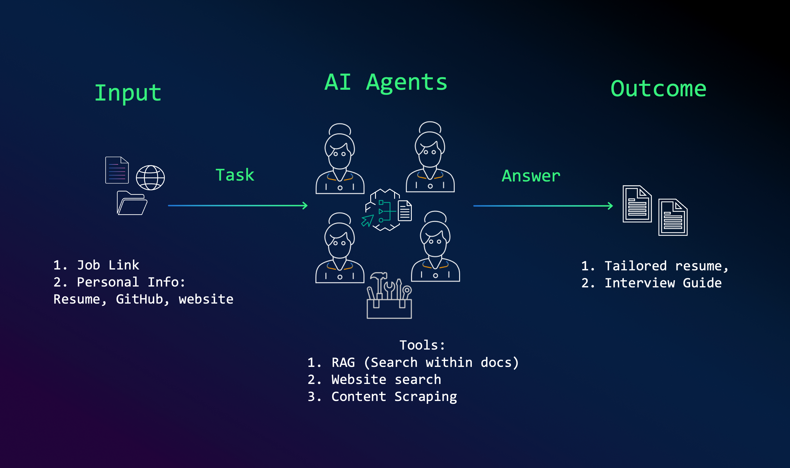
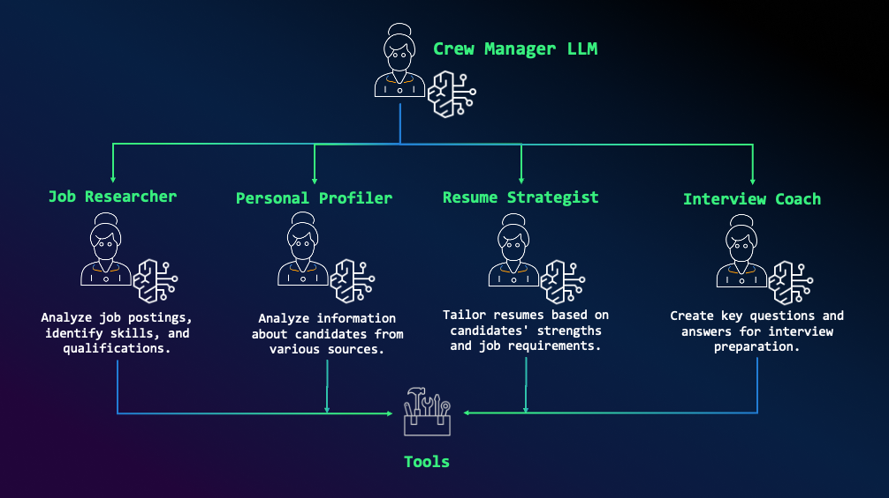

# Aijobhunter Crew

Welcome to the Aijobhunter Crew project, powered by [crewAI](https://crewai.com). This template is designed to help you set up a multi-agent AI system with ease, leveraging the powerful and flexible framework provided by crewAI. Our goal is to enable your agents to collaborate effectively on complex tasks, maximizing their collective intelligence and capabilities.

## 🚀 AI Agents for Resume Optimization

This repository demonstrates how **AI agents** can assist in **resume tailoring and interview preparation** by analyzing job postings, extracting relevant skills, and optimizing application materials. The **multi-agent system** leverages **Amazon Bedrock** and **CrewAI** to automate resume enhancement and interview readiness.

<p align="center">
  
</p>

## 🌟 How It Works

The system takes in inputs like **resumes, GitHub profiles, and personal websites**, processes them using AI agents, and produces tailored resumes and interview Q&A to maximize job application success.

### **🔹 Agents & Responsibilities**
1. **Job Researcher** – Extracts key skills and qualifications from job postings.
2. **Personal Profiler** – Analyzes the candidate’s strengths from various online sources.
3. **Resume Strategist** – Customizes resumes based on the extracted insights.
4. **Interview Coach** – Generates key Q&A for interview preparation.

Each agent works in collaboration under a **Crew Manager LLM**, ensuring a structured workflow.

<p align="center">
  
</p>

## Installation

Ensure you have Python >=3.10 <3.13 installed on your system. This project uses [UV](https://docs.astral.sh/uv/) for dependency management and package handling, offering a seamless setup and execution experience.

First, if you haven't already, install uv:

```bash
pip install uv
```

Next, navigate to your project directory and install the dependencies:

(Optional) Lock the dependencies and install them by using the CLI command:
```bash
crewai install
```

### Customizing

**Add your `OPENAI_API_KEY` into the `.env` file**

- Modify `src/aijobhunter/config/agents.yaml` to define your agents
- Modify `src/aijobhunter/config/tasks.yaml` to define your tasks
- Modify `src/aijobhunter/crew.py` to add your own logic, tools, and specific args
- Modify `src/aijobhunter/main.py` to add custom inputs for your agents and tasks

## Running the Project

To kickstart your crew of AI agents and begin task execution, run this from the root folder of your project:

```bash
$ crewai run
```

This command initializes the AIJobHunter Crew, assembling the agents and assigning them tasks as defined in your configuration.

This example, unmodified, will create a `report.md` file with the output of research on LLMs in the root folder.

## Understanding Your Crew

The AIJobHunter Crew is composed of multiple AI agents, each with unique roles, goals, and tools. These agents collaborate on a series of tasks, defined in `config/tasks.yaml`, leveraging their collective skills to achieve complex objectives. The `config/agents.yaml` file outlines the capabilities and configurations of each agent in your crew.

## Acknowledgment

This project is inspired by the work of [João Moura](https://github.com/joaomdmoura), the creator of CrewAI, and [Viktoria Semaan](https://github.com/viktoriasemaan).

## Support

For support, questions, or feedback regarding the Aijobhunter Crew or crewAI.
- Visit our [documentation](https://docs.crewai.com)
- Reach out to us through our [GitHub repository](https://github.com/joaomdmoura/crewai)
- [Join our Discord](https://discord.com/invite/X4JWnZnxPb)
- [Chat with our docs](https://chatg.pt/DWjSBZn)

Let's create wonders together with the power and simplicity of crewAI.
